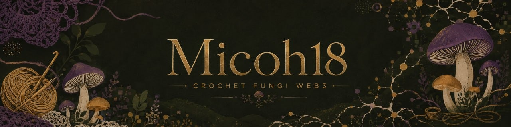
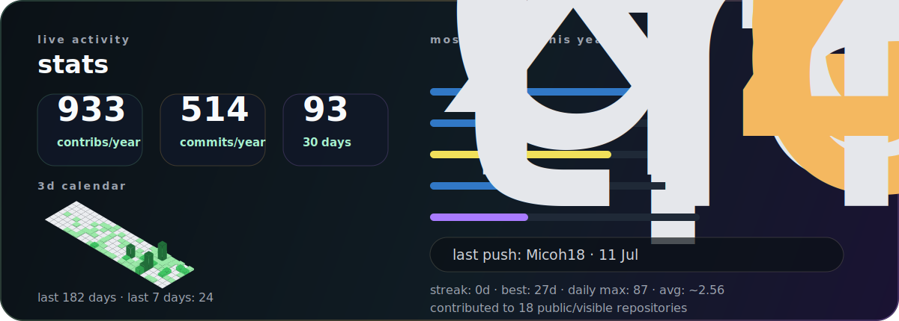

## GM!!

Hi! I’m Micoh. I really like nerdy stuff, fungi, and crocheting. I’m on a path to learning new skills and connecting with people, so feel free to reach out. 🧶🍄

## living pieces

- **[Hyphash](https://github.com/Micoh18/Hyphash)** — exploration around fungi images, visual validation, and open collections.
- **[x402Warden-Solana](https://github.com/Micoh18/x402Warden-Solana)** — settlement firewall that protects autonomous AI agents
- **[Datavend-x402-Stellar](https://github.com/Micoh18/Datavend-x402-Stellar)** — experiments around selling and accessing data with x402 and Stellar.
- **[mycoregenera](https://github.com/Micoh18/mycoregenera)** — ideas across mycology, regeneration, and digital tools.
- **[diverge-hacka](https://github.com/Micoh18/diverge-hacka)** — fast-moving web prototypes.
- **[Mr-Mainspring](https://github.com/Micoh18/Mr-Mainspring)** — another workshop piece: automation, product, and craft in progress.

## tools near the desk

## live activity

> *Following the thread is also a way to research.*

## where to find me

---

Made with calm.

